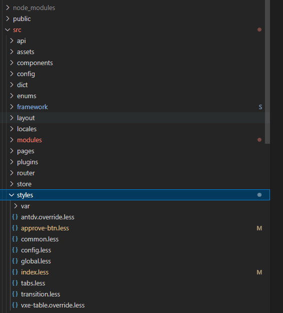

### CSS JS TS代码规范、知识点  
[MDN](https://developer.mozilla.org/zh-CN/)  
[TS zh](https://typescript.bootcss.com/)  
[TS en](https://www.typescriptlang.org/docs/handbook/intro.html)  

----

### CSS部分
#### 规范
- 缩进使用两个空格
- 每个声明块的左花括号前添加空格
- 声明块的右花括号必须单独成行
- 每个声明语句：后应该添加一个空格，前面不需要
- 所有语句都要以分号结尾
- 选择器分组时，每一个单独成一行(如果后代选择比较多可能会难阅读)
- 为属性选择器中的属性添加双引号  
- class命名用‘-’分割
- class命名尽量语义化，不要采用单个通用的词比如: left right title content header footer container item btn link
- 尽量不用float完成布局
- 选择器层级不要超过5级(less、sass的嵌套)
- 如果属性值为0，不加单位
- 小数值小于1，别写.前面的0
- 不滥用id

----
- css属性顺序
1. 位置属性(position, top, right, z-index, display, float等)
2. 大小(width, height, padding, margin)
3. 文字系列(font, line-height, letter-spacing,color,text-align等)
4. 背景(background, border等)
5. 其他(animation, transition等)

----

#### 代码结构
src/styles/目录下为公共样式，可以更方便的统一框架中的样式，现在项目中手写的样式比较少，将来如果界面许多设计需要手写样式，可以拆分文件，统一在index.less中导入。  
组件样式写在内部style标签或者组件所在目录的styles文件夹下。
  

----

#### 遇到的一些问题
- vue中style标签没加scoped，导致组件样式变为全局的，此时如果写了一个样式，而且这个样式偏偏在其他地方用到了，可能会发现一个地方页面莫名其妙样式变了
这时候如果命名可以更细节一点可能不会重名；使用scoped直接避免这种问题
``` html
<style>
.title: {
  line-height: 50px;
}
</style>
```
- vue中使用深层选择修改子组件内的样式，而不是去掉scoped实现同样的效果
``` html
<style scoped>
.supertable :deep(.ant-card-body) {
  padding: 0;
}
/* 将会编译成 */
.supertable[data-v-42f62ae6] .ant-card-body) {
  padding: 0;
}
</style>
```

----

- 不滥用后代选择器，应该尽量使用直接子代选择器，虽然当前使用时效果是一样的，在复杂的嵌套中，可能某个后代的样式被很久之前的后代选择器修改了，增加了debug困难。
```css
/** 不好的 */
.a .b {

}
/** 好的 */
.a > .b {
  
}
```
- 避免重复引用，之前在写代码的时候会将less变量和一些样式混合在一个文件中书写，当需要使用变量时就会引用该文件，但是造成的问题就是大量的重复样式引用，在浏览器中调试时很影响体验。所以全局的变量，局部的需要引用的变量等单独写在一个文件中。

----

### JS部分
#### 代码规范
- 缩进统一使用两空格的方式
- 在语义结尾处使用分号
- 逗号的多行结构，不使用行首逗号
- 字符串优先使用单引号
- 使用 const 或 let 声明
- 优先使用const，当变量会被重新赋值时才使用let
- 不要重复声明变量和函数
- 变量不要与外层作用域已经存在的变量重名
- 使用Number()parseInt()和String()之类的显式类型转换，而不要使用隐式类型转换
- 模板字符串代替字符串拼接
- 尽可能使用扩展运算符进行数组的复制，拼接。
- 灵活使用解构
- 键值对能简写的必须简写
- 使用扩展运算符代替Object.assign方法，来进行浅拷贝。
----
- 使用箭头函数代替匿名函数
- 箭头函数只有一条return语句时，{}和return不写
- 箭头函数只有一个参数的时候，（）不写
- 箭头函数当return内容为对象时，需要使用（）
- 使用es6的默认参数语法
- 将有默认值的参数，放在最后
- 使用严格相等运算，而不使用== !=的隐式转换
- 避免三元表达式的嵌套
- 混合操作符时，尽量用()区分优先级
- 禁用eval
- 生产环境禁止使用console，涉及到垃圾回收机制
- 小驼峰（camelCase）命名原始对象、对象、函数、实例
- 大驼峰命名类、构造函数、type、interface、组件名
- 常量 用全部大写字母，下划线分隔模式
- 不要使用保留字命名
- 语义化变量
- 没必要的变量以及有必要的中间变量    
- window上的变量带上window.  
- ... 数组/对象浅拷贝; 函数的剩余参数  
- 善用|| && ??  
- 不修改函数参数（引用相关）  

----

#### 遇到的一些问题
- 引用问题  
  将对象或者数组传递给方法或者组件，不经意间修改了引用值，比如push、修改值。可能在使用时没有任何问题，但是使用结束后发现原先的值莫名其妙被改动，或者产生超出期望的值。解决方案就是进行拷贝，操作备份的数据，除非特殊情况必须用到引用特性。
- 组件销毁时残留的状态  
  比如定时器、浏览器事件  
  比较常见的是：组件创建时创建了定时器，但是组件销毁时没有清除定时器，组件再次创建时重复创建了定时器，此时组件中就有多个相同功能的定时器。  
  websocket  
  mqtt订阅  
  
- 更易阅读的代码  
  避免大量的方法维护大量的变量，可读性非常差，可以适当拆分，拆分后进行合理的命名，可以提升阅读体验。
- true false 隐式类型转换  

----

- 值班时出现的一个bug，老师在工作时，电脑开着主页面长时间几乎不会切换，点击弹出窗口，窗口中的业务是做一个校验，但是校验的源数据是主页面的数据，此时老师进行操作时，页面数据是老旧的，点击弹窗校验也不会通过，因为当前表格的数据没有主动点击搜索不会更新成最新的。由此可以反映出几个问题：
1. 前端校验数据合适吗
2. 前端应该更频繁的和后端交互。在bis项目中，同一功能同时也就一两个人在操作，假如是一个体量大一些的系统，更多的并发、业务流程更紧密，此时频繁的和后端交互而不是使用前端保存的数据进行处理更好。
3. 开发和测试时，更应该模拟真实的场景，比如用户不会闲的没事就刷新页面，如果刷新页面后某个功能是好用的，但是在多次、长时间使用后功能是否正常、页面性能是否正常。假如多次执行一个操作后页面逻辑有错误，后可能产生一些bug。

----
##### vue3
- vue3中setup语法糖和setup方法中书写代码可能比较随意，此时更需要一个规范来规定代码大致结构
- 最先定义props emits route router
- 相同的功能模块的代码集中在一起，一块代码中变量、computed、方法、watch
- hooks 可复用逻辑
- JSX 封装可复用组件逻辑。不用为了封装而封装，有时候写的写的觉得这一片好像都一样或者相似，就可以放一起；但是如果是大篇幅的内容就不要可以去复用了，假如项目迭代中其中一个情况要做修改，此时兼容多种复用的情况也是麻烦事。

----

### TS部分
尽量不指定为any和默认的any，所有能完善的类型都尽量书写好类型  
```typescript
// 函数的参数类型和返回值。参数默认为any，如果不小心传错参数根本不会告诉你
const getData = (params: ParamsType):FuncReturnType<{a:string}> => {}
```
开始可能会觉得写TS是一件浪费时间的事情，那说明运用不够熟练  
提前定义好类型，编写代码有提示，很多bug可以直接报警告，而不是上下文翻了半天才发现，某个对象访问中间少了一层  
```typescript
const state = {
  e: {
    f: true
  }
}
if (state.f) {
  // ...
}
```  

#### 知识点
基础类型  
interface  
type  
enum  
T  
协变 逆变  

----

## 总结
无论是代码基础规范还是结构、逻辑规范，都是约束大家写出更简单更易阅读的代码，假如逻辑混乱代码结构差，可能有些代码在几个月后自己都难以阅读，我们要有一种服务于后续维护代码的人的思想，编码的时候思考这些东西好读吗，是不是大致浏览就能看出功能，同时要避免一些隐藏的，难以发现的问题。