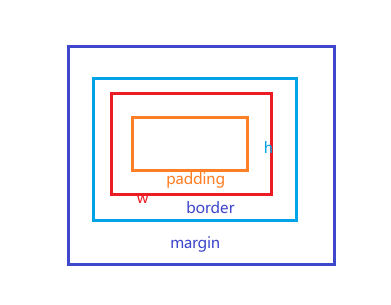
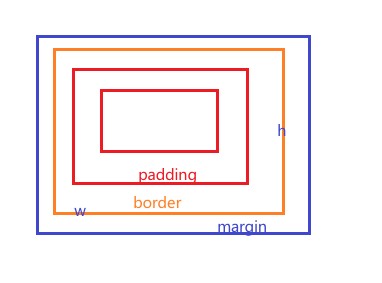

# CSS JS TS代码规范、知识点  
[MDN](https://developer.mozilla.org/zh-CN/)  
[TS zh](https://typescript.bootcss.com/)  
[TS en](https://www.typescriptlang.org/docs/handbook/intro.html)  
知识点很杂很多，一一例举不太合适，有这工夫看会儿文档更好，写一些个人理解
# CSS部分
### 选择器  

### 盒子模型  
content-box  
  
border-box(IE默认盒子模型)  
  
比如有一块宽高确定的区域需要放置一个带border的box此时如果要完美放入需要设置
```css
.a{
  width:calc(100% - border-right - border-left);
  height:calc(100% - border-top - border-bottom);
}
```
或者
```css
.a{
  box-sizing:border-box;
  width: 100%;
  height: 100%;
}
```
[盒模型示例](./css/box-sizing.html)

### 块元素 内联元素
块级元素默认具有100%宽度且占一整行  
内联元素默认被内容撑开 x轴方向的margin生效  
inline-block具有块元素的属性但是不换行  
[块元素示例](./css/block-inline.html)
### 流式布局 flow layout
在没有对样式进行任何修改时，html中的标签会按照默认的样式，比如自身默认的块元素或者内联元素布局

### 定位position  
[static(默认流式布局) ](./css/position-static.html)   
[relative(相对定位)](./css/position-relative.html) 相对于默认文档流位置偏移量   
[absolute(绝对定位)](./css/position-absolute.html) 相对于第一个非static父元素偏移量  
[fixed(不常用)](./css/position-fixed.html)  类似absolute移除文档流但是页面在滚动时，依然保持在页面中。需要注意absolute相对于第一个不是static定位的祖先元素，而fixed相对于transform、perspective或filter不为none的祖先元素，或者相对于视口  
[sticky(不常用)](./css/position-sticky.html)  类似fixed但开始时表现为正常流布局  
### flex布局  

# JS部分
## 代码规范

const  
let  
缩进 空格 html双引号 js单引号 语义化变量 没必要的变量  
window上的变量带上window.  


## 知识点
``(模板字符串)  
引用、值传递 可能会造成的影响  
高阶函数 map filter reduce sort some every find  
Promise await async  
闭包  
箭头函数  
纯函数  
esmodule  

# TS部分

## 知识点
类型  
interface  
type  
enum  
T  
协变 逆变  
